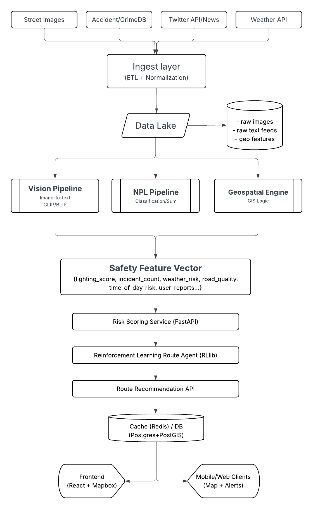

# SafeRouteAI – AI-Powered Smart Navigation for Pedestrian & Cyclist Safety

SafeRouteAI is an **AI-powered navigation system** that recommends the safest routes for pedestrians and cyclists.  
Unlike traditional navigation apps that only optimize for speed, SafeRouteAI incorporates **real-world safety factors** such as:
- Accident & crime data
- Weather conditions
- Lighting and road quality from street-level images
- Real-time incident reports from news and social media

---

## What It Does ?

Cities are getting crowded, and navigation apps like Google Maps only optimize for speed, not safety. Pedestrians and cyclists often face unsafe routes (poor lighting, lack of sidewalks, high accident zones).

**SafeRouteAI solves this by**:

1. **Collecting real-world data**: Accident reports, crime statistics, weather APIs, traffic feeds, and OpenStreetMap data.

2. **Analyzing risk factors** with Hugging Face models:

    - Detect poorly lit or unsafe areas from **Image-to-Text** street view images.

    - Use **Text Classification** + **Zero-Shot Classification** on local news/Twitter feeds to detect safety incidents (accidents, thefts, harassment).

    - Use **Reinforcement Learning** to dynamically recommend routes balancing speed vs safety.

**Output**: A **safety-optimized navigation app** for cyclists/pedestrians, with an interactive map showing “safest” and “riskiest” paths in real-time.

---

## System Architecture & Implementation Plan

### 1. High-level Architecture:

 

### 2. Component details & tech choices

**Ingest layer**

- **Purpose**: Periodically pull and normalize external sources.

- **Tools**: Python scripts + Airflow (or Cron for MVP)

- **Sources & formats**

    - Street images: Mapillary or Google Street View API (where allowed)

    - Accident/crime: City open data portals (CSV/JSON)

    - Social: Twitter API filtered by geotags + news RSS

    - Weather: OpenWeatherMap

- **Data lake & storage**

    - **S3-compatible (or local / MinIO for dev)** for raw assets

    - **Postgres + PostGIS** for routes & geo features

    - **Redis** for caching computed safety scores / routes

- **Vision pipeline**

    - **Task**: Image-to-Text + object detection for road conditions & lighting

    - **Hugging Face models**: BLIP2 or VisionEncoderDecoder (image-to-text), CLIP for similarity

    - **Inference**: Host via Hugging Face Inference Endpoints (or self-host with TorchServe for cost control)

    - **Outputs**: `lighting_level`, `crosswalk_present`, `pothole_confidence`, `vehicle_density_estimate`

- **NLP pipeline**

    - **Task**: Classify textual incidents, summarize noise, extract entities + geolocation inference

    - **Hugging Face models**: RoBERTa / DeBERTa for classification, T5 for summarization, zero-shot models for emerging categories

    - **Outputs**: `incident_type`, `severity`, `time`, `location_prob`

- **Geospatial engine**

    - **Task**: Map safety signals onto road segments

    - **Tech**: PostGIS queries, routing via OSRM / GraphHopper

    - **Output**: per-segment safety vector and aggregated `safety_score`

- **Risk Scoring**

    - **Service**: FastAPI microservice that ingests feature vectors and computes safety scores (explainable weights)

    - **Modeling**: Start with weighted heuristic + gradient boosting (XGBoost) trained on historical accident counts; later augment with learned models

    - **Explainability**: Return top contributing factors per segment

- **RL-based routing**

    - **Goal**: Optimize routes for user-defined tradeoff (safety ↔ time)

    - **Framework**: RLlib or Stable-Baselines3 for prototyping

    - **State**: segment safety, distance left, time, weather, user preference

    - **Action**: choose next segment; reward = negative time penalty + safety bonus (customizable)

    - **Fallback**: deterministic multi-criteria shortest-path (Pareto) for MVP

- **Frontend UX**

    - **Stack**: React + Mapbox GL / Leaflet

    - **UX features**:

        - Two toggles: “Safest route” vs “Fastest route” vs a slider between them

        - Map overlays: heatmap of safety, per-segment scores, user-report pins

        - Route comparison UI: side-by-side ETA vs safety delta

        - Lightweight timeline / feed for local alerts (summaries + confidence)

- **Ops & Deployment**

    - **Containerization**: Docker for all services

    - **Orchestration**: Kubernetes (GKE/EKS) for scale; use Docker Compose for dev

    - **CI/CD**: GitHub Actions — build → test → container push → deploy

    - **Monitoring**: Prometheus + Grafana; Sentry for errors

    - **Cost-saving**: Use batch processing for image inference; use Hugging Face hosted endpoints for quick MVP.

### 3. Concrete API endpoints (FastAPI examples)

- `POST /route`
  Request: `{ start, end, preference: "safety" | "time" | 0..1 tradeoff }`
  Response: `{ route: [latlon...], eta, safety_score, explanation }`

- `GET /segment/{id}/score`
  Response: `{ segment_id, safety_score, contributors: [{factor, weight}] }`

- `POST /report` (user-submitted)
  Body: `{ lat, lon, type, description, image? }` → used for retraining / feedback loop

- GET `/alerts?bbox=...`
  Real-time summarized alerts in bounding box

### 4. Hugging Face model choices & usage patterns

- **Image-to-Text**: `Salesforce/blip2` or `microsoft/git` — run inference on street images to extract textual cues. Use batching for throughput.

- **CLIP / Vision encoders**: for similarity search (e.g., detect “poor lighting” by comparing to labeled examples).

- **Text classification**: `roberta-large-mnli` for zero-shot incident classification; fine-tune for city-specific labels later.

- **Summarization**: small `t5-base` for condensing long news/incident text.

- **RL**: RLlib (not on HF, but uses HF models for components if needed).

**Inference strategy**: Use Hugging Face Inference Endpoints or Amazon Sagemaker for managed scaling. For cost control, run nightly batch passes on new images and store results in DB; only do on-demand inference for user-submitted images.

### 5. Privacy, safety, and ethics

- Don’t store or expose personal identifiers from tweets/images; strip PII.

- Rate-limit and validate user-uploaded images (avoid real-time CCTV scraping unless permitted).

- Provide clear TOS: “data is for navigation assistance — not surveillance.”

- Offer opt-out for location/history storage.

---

## ⚙️ Tech Stack

**AI Models** (Hugging Face):
- BLIP/CLIP (Image-to-Text)

- RoBERTa/BERT (Text Classification, Summarization)
  
- RLlib / Stable-Baselines3 (Reinforcement Learning)
 
**Data Sources**: OpenStreetMap, Government accident/crime DBs, Twitter API, Weather APIs

---

## 📊 Future Improvements

- User feedback loop → crowdsource safety ratings

- Multi-city support with scalable ingestion pipelines

- Integration with IoT/smart city infrastructure

- Mobile app with push safety alerts

---

## 📄 License

Apache License 2.0
